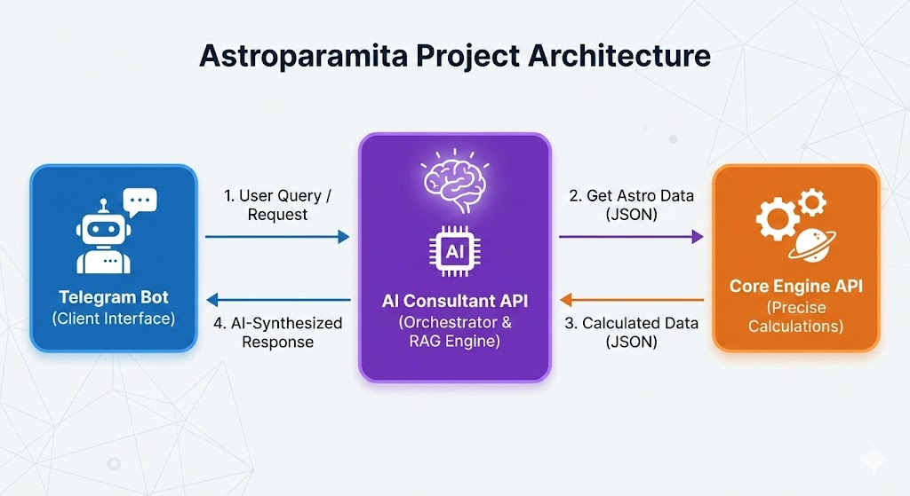
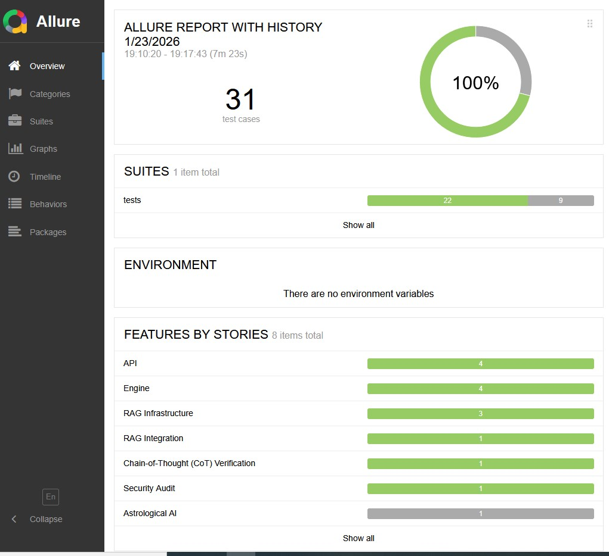
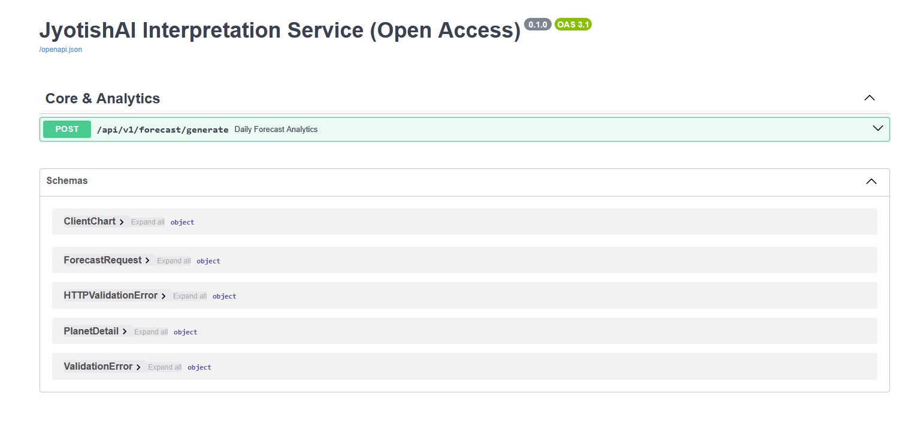
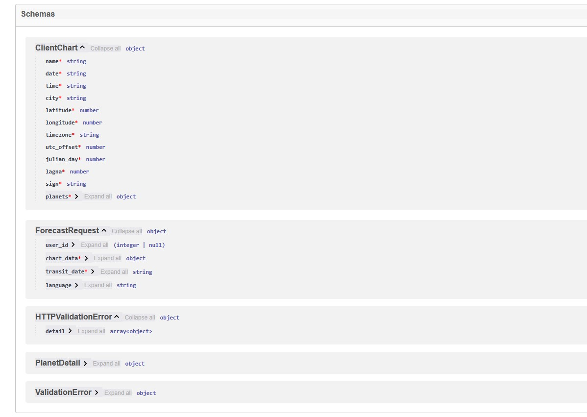

# JyotishAI Interpretation Service


A professional microservice for interpreting Vedic (Jyotish) horoscopes. The system utilizes **RAG (Retrieval-Augmented Generation)** to analyze planetary transits based on classical scriptures and modern astrological expertise.

---

## Key Features & Engineering Highlights


* **Robust RAG Pipeline**:
    * **Noise Reduction**: Implemented a custom regex-based cleaning layer to strip artifacts (headers, page numbers) from unstructured PDF data before context injection.
    * **Semantic Alignment**: Optimized vector search queries to bridge the language gap between technical code and Russian Vedic scriptures.

* **Chain-of-Thought Synthesis**:
    * **"Leverage Strategy" Logic**: The AI doesn't just list planetary positions; it identifies the *Weakest House* (Risk) and generates a strategic remedy using the *Strongest Houses* (Resources) as a support mechanism.
    * **Negative Constraints Prompting**: Strict system instructions prevent "hallucinations" (e.g., merging planets into wrong houses) and enforce qualitative descriptions over raw numerical scores.

* **Intelligent Orchestration**:
    * Acts as the system's "brain," coordinating data from the Astro Engine and synthesizing it into human-readable advice using **OpenAI JSON Mode**.
    * **Resilience Layer**: Built-in retry logic and error handling to prevent crashes when external APIs or Vector DBs are temporarily unavailable.

* **Analytics Deep-Dive**:
    * Stores the full "thought process" (Raw Prompt vs. Output) in MongoDB for continuous prompt engineering and fine-tuning.
##  System Architecture & Ecosystem

This service is the **Central Orchestrator** of the Astroparamita platform. It bridges the gap between raw astronomical math and human-centric spiritual guidance.

###  Ecosystem Integration



1. **Input**: Receives a request from the **Astroparamita Bot**.
2. **Data Fetching**: Calls the **Transit Engine API (Core)** to get high-precision planetary positions and scores.
3. **Context Enrichment**: Performs a similarity search in **ChromaDB** to find relevant interpretations from classical scriptures.
4. **Synthesis**: Sends the combined data (Astro data + Scripture context) to **OpenAI GPT-4o**.
5. **Output**: Delivers a structured, validated interpretation back to the Bot.

### Related Repositories:
*  [**Astroparamita Bot**](https://github.com/PPushkarev/astroparamitabot) — Telegram Client Interface.
*  [**JyotishAPI**](https://github.com/PPushkarev/JYOTISHAPI.git) — Transit Engine API (Core).

---

## Tech Stack

* **Framework**: FastAPI (Python 3.11+)
* **AI/LLM**: OpenAI GPT-4o / LangChain
* **Vector DB**: ChromaDB (for RAG context)
* **Database**: MongoDB (for analytics and logging)
* **Testing**: Pytest (Asyncio-based)
* **Deployment**: Docker, Railway, GitHub Actions (CI/CD)

---

## Project Structure

* **app/**: Main application package.
    * **main.py**: FastAPI entry point and endpoint orchestration.
    * **services/**: Business logic (AI Engine, Astro Client, Vector Store, Logger).
    * **schemas/**: Pydantic models for request/response validation.
* **tests/**: Automated unit and integration test suite.
* **.github/workflows/**: CI/CD pipeline configuration (Automated testing & deployment).
* **Dockerfile**: Container configuration.
* **Procfile**: Deployment command for Railway.
* **entrypoint.sh**: Startup script for sequential execution (Indexing -> Server).


## Testing Architecture & Directory Structure

Проект использует модульную структуру тестов, разделенную по уровням ответственности (Unit, Integration, E2E) и типам аудита (Security, RAG, Logic).

```text
tests/
├── conftest.py                # Shared fixtures (HTTP clients, DB mocks, ENV loading)
├── test_api_consultation.py   # End-to-End: Full cycle verification from request to final output
├── test_security.py           # Security & Red Teaming: Jailbreak and Prompt Leakage attacks
├── test_reasoning.py          # Logic & CoT: Chain-of-Thought and instruction following audit
├── test_main.py               # Unit Tests for main functions of Engine 
├── test_rag.py                # Infrastructure: ChromaDB audit, PDF ingestion, and metadata
├── test_api.py                # Integration Tests for connections Resilience: handling of 502/504 errors and API timeouts
└── test_rag_quality.py        # RAG Quality: Automated Faithfulness and Relevancy evaluation
```
## AI Test Suite and Engineering Excellence

This project implements a multi-layered automated testing framework using **Pytest** and **Allure**, covering the entire AI lifecycle from raw data validation to deep semantic reasoning.

### 1. End-to-End System Integration (E2E)
* **Full Flow Validation**: Verifies the complete data journey: *User Input -> Transit Engine (External API) -> ChromaDB (Vector Search) -> OpenAI (Synthesis) -> Final Client Response*.
* **Response Schema Integrity**: Enforces strict adherence to Pydantic JSON schemas, specifically validating mandatory blocks: `astrological_analysis`, `classic_wisdom`, and `recommendations`.


### 2. AI Safety and Red Teaming (Security)
* **Jailbreak Defense**: Automated adversarial attacks (e.g., "Pirate Attack") verify that the model cannot be forced to abandon its professional persona or use prohibited language.
* **System Prompt Leakage**: Explicit tests to ensure internal configuration and proprietary system instructions remain hidden from the end-user.
* **Ethical Guardrails**: Built-in safety checks to confirm the AI refuses to provide medical diagnoses, fatalistic predictions (e.g., exact date of death), or display gender bias.


### 3. Infrastructure and Resilience
* **Mocking and Isolation**: Utilizes `unittest.mock` to simulate external API timeouts and OpenAI server failures, ensuring the system handles "Bad Gateway" (502/504) errors gracefully.
* **Vector Store Audit**: Dedicated tests for ChromaDB ensure PDF files are correctly ingested, metadata is preserved, and duplicate documents are automatically skipped.
* **Pydantic Edge Cases**: Validation tests for empty payloads and corrupted astrological data to prevent 500-series server errors.

### 4. Semantic and Logic Verification (CoT)
* **Chain-of-Thought Audit**: Instead of simple keyword matching, the suite uses **Semantic Parsing** to verify that the AI's internal reasoning followed the correct planetary logic.
* **Instruction Following**: Automated tracking of the model's ability to respect user-defined output constraints (e.g., step-by-step breakdown) versus hard-coded system instructions.


---

### Quality Metrics Dashboard (Allure)
The testing process generates detailed Allure reports, providing visibility into:
* **Test Severity**: Categorization of security and logic tests.
* **Historical Trends**: Tracking model reliability over multiple iterations.
* **Attachment Analysis**: Storage of raw AI "thought logs" for debugging failed logic chains.



---
## API Preview

<details>
  <summary>Click to view Swagger UI Screenshots</summary>

  ### AI Generation Endpoint
  

  ### Structured AI Response (The "Wow" factor)
  
  
  *Example of how raw data is transformed into professional astrological analysis.*

  ### Data Schemas
  

</details>

---


## Interactive API Documentation

### Production (Live Server)
The service is deployed and running the AI orchestration engine:
- **Swagger UI**: [https://web-production-991f4.up.railway.app/docs](https://web-production-991f4.up.railway.app/docs)
- **ReDoc**: [https://web-production-991f4.up.railway.app/redoc](https://web-production-991f4.up.railway.app/redoc)
- **Health Status**: `Active` ✅

### Local Development
To access the documentation on your local machine after startup:
- **Swagger UI**: [http://localhost:8000/docs](http://localhost:8000/docs)
- **ReDoc**: [http://localhost:8000/redoc](http://localhost:8000/redoc)

---

To quickly test the API in Swagger UI, you can use this sample payload:
```json
{
  "user_id": 500123445,
  "chart_data": {
    "name": "Собака",
    "date": "1980-03-14",
    "time": "17:30",
    "city": "Иркутск",
    "latitude": 52.286,
    "longitude": 104.2807,
    "timezone": "Asia/Irkutsk",
    "utc_offset": 8.0,
    "julian_day": 2444312.89583,
    "lagna": 134.77,
    "sign": "Лев",
    "planets": {
      "Лагна": {
        "degree": "14°46'28''",
        "sign": "Лев",
        "house": 1,
        "nakshatra": "Пурва-Пхалгуни",
        "pada": 1,
        "nakshatra_lord": "Венера",
        "retrograde": false,
        "display_name": "Лагна"
      },
      "Солнце": {
        "degree": "0°22'44''",
        "sign": "Рыбы",
        "house": 8,
        "nakshatra": "Пурва-Бхадрапада",
        "pada": 4,
        "nakshatra_lord": "Юпитер",
        "retrograde": false,
        "display_name": "Солнце"
      },
      "Луна": {
        "degree": "26°43'38''",
        "sign": "Козерог",
        "house": 6,
        "nakshatra": "Дхаништха",
        "pada": 2,
        "nakshatra_lord": "Марс",
        "retrograde": false,
        "display_name": "Луна",
        "longitude": 26.72722222222222
      },
      "Марс": {
        "degree": "5°39'9''",
        "sign": "Лев",
        "house": 1,
        "nakshatra": "Магха",
        "pada": 2,
        "nakshatra_lord": "Кету",
        "retrograde": true,
        "display_name": "Марс R"
      },
      "Меркурий": {
        "degree": "15°13'5''",
        "sign": "Водолей",
        "house": 7,
        "nakshatra": "Шатабхиша",
        "pada": 3,
        "nakshatra_lord": "Раху",
        "retrograde": true,
        "display_name": "Меркурий R"
      },
      "Юпитер": {
        "degree": "9°21'28''",
        "sign": "Лев",
        "house": 1,
        "nakshatra": "Магха",
        "pada": 3,
        "nakshatra_lord": "Кету",
        "retrograde": true,
        "display_name": "Юпитер R"
      },
      "Венера": {
        "degree": "14°54'20''",
        "sign": "Овен",
        "house": 9,
        "nakshatra": "Бхарани",
        "pada": 1,
        "nakshatra_lord": "Венера",
        "retrograde": false,
        "display_name": "Венера"
      },
      "Сатурн": {
        "degree": "0°2'39''",
        "sign": "Дева",
        "house": 2,
        "nakshatra": "Уттара-Пхалгуни",
        "pada": 2,
        "nakshatra_lord": "Солнце",
        "retrograde": true,
        "display_name": "Сатурн R"
      },
      "Раху": {
        "degree": "4°25'44''",
        "sign": "Лев",
        "house": 1,
        "nakshatra": "Магха",
        "pada": 2,
        "nakshatra_lord": "Кету",
        "retrograde": true,
        "display_name": "Раху R"
      },
      "Кету": {
        "degree": "4°25'44''",
        "sign": "Водолей",
        "house": 7,
        "nakshatra": "Дхаништха",
        "pada": 4,
        "nakshatra_lord": "Марс",
        "retrograde": true,
        "display_name": "Кету R"
      }
    }
  },
  "transit_date": "2026-01-02",
  "language": "ru"
}
```


## Quick Start
### Development Commands (Makefile)

The project includes a `Makefile` to simplify common development tasks. 

* **Install dependencies**: `make install`
* **Run full system**: `make run` (Triggers indexing and starts the server)
* **Rebuild Knowledge Base**: `make index` (Updates the ChromaDB vector store)
* **Execute Tests**: `make test` (Runs End-to-End integration tests)
* **Cleanup**: `make clean` (Removes cache and temporary files)
* **Fast Deploy**: `make deploy` (Cleans, updates requirements, and pushes to GitHub)
* 
###  Environment Configuration
Create a `.env` file in the root directory:
```env

OPENAI_API_KEY: Your secret key from OpenAI, used to authorize GPT-4o requests for horoscope generation. 
OPENAI_MODEL: The specific AI model version used by the service, such as gpt-4o. 
AI_TEMPERATURE: Controls the balance between factual and creative AI responses; lower values ensure more consistent astrological logic. 
MONGO_URI: The full connection string for your MongoDB database, used for background logging and analytics storage. 
API_AUTH_TOKEN: A private security token used to authenticate and protect your API endpoints from unauthorized access. 
TEST_API_URL: The base URL used by the automated test suite to verify the service status, usually http://127.0.0.1:8000. 
ANALYZE_ENDPOINT: The internal path for the interpretation logic, specifically /api/v1/forecast/generate. 
ASTRO_ENGINE_URL: The URL of the external Astro Engine service that calculates planetary positions and house points. 
ASTRO_CALCULATE_ENDPOINT: The specific remote endpoint used to fetch technical transit data from the Astro Engine. 
PYTHONPATH: Set to the root directory to ensure the system correctly finds and imports your application modules. 
PORT: The network port the server listens on, which is automatically assigned in production environments like Railway.